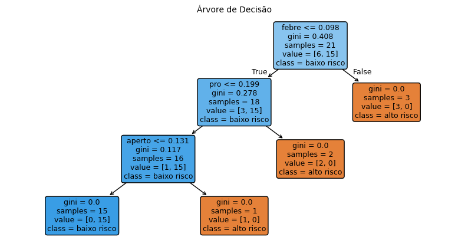
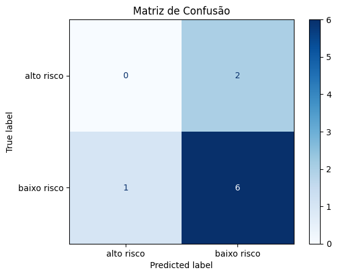
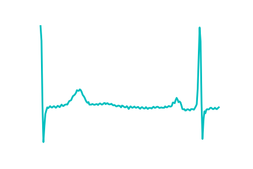
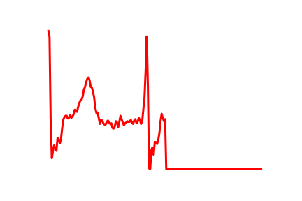

# FIAP - Faculdade de Informática e Administração Paulista

<p align="center">
  <a href="https://www.fiap.com.br/">
    
  </a>
</p>

## 👨‍🎓 Integrantes do Grupo

- Amanda Vieira Pires (RM566330)
- Ana Gabriela Soares Santos (RM565235)
- Bianca Nascimento de Santa Cruz Oliveira (RM561390)
- Milena Pereira dos Santos Silva (RM565464)
- Nayana Mehta Miazaki (RM565045)

## 👩‍🏫 Professores

### Tutor(a)

- Caique Nonato da Silva Bezerra

### Coordenador(a)

- André Godoi

---

# ❤️ CardioIA – Fase 2

## 🎥 Vídeo de Demonstração

[](https://youtu.be/vxSZyMZO1Zo)

## 🎯 Visão Geral

**CardioIA - Fase 2** é uma solução completa de suporte ao diagnóstico cardiovascular utilizando Inteligência Artificial, dividida em três etapas progressivas:

### 📊 **Parte 1: Extração de Sintomas (NLP)**
Processamento de linguagem natural com fuzzy matching para extrair sintomas de relatos textuais em português coloquial. Mapeamento automático de 30 casos clínicos para 6 diagnósticos diferentes (Infarto, Insuficiência Cardíaca, Enxaqueca, Pneumonia, Ansiedade, Gastrite) com **100% de confiança e 0% de casos inconclusivos**.

### 📄 **Parte 2: Triagem de Risco (Decision Tree)**
Classificador preditivo que automatiza a triagem de pacientes em **Alto Risco** e **Baixo Risco** usando algoritmos de Machine Learning (Árvore de Decisão com TF-IDF). Acurácia de **70%** com validação cruzada, garantindo agilidade no atendimento de casos críticos.

### 🏥 **Ir Além 1:  CardioIA Portal**

Portal de diagnóstico cardiovascular desenvolvido em React + Vite para simulação de gerenciamento de pacientes e consultas cardiológicas.

### 📈 **Ir Além 2: Diagnóstico Visual com MLP**
Rede Neural Artificial (Perceptron Multicamadas) para análise de imagens de eletrocardiogramas (ECG), classificando-os como **Normal** ou **Anormal**. Alcança **~81% de acurácia** incorporando técnicas de visão computacional.

**Impacto:** Triagem automatizada, redução de tempo diagnóstico, e suporte à decisão clínica em múltiplos níveis (textual, categorização de risco e análise de exames).

---

## 📁 Estrutura do Projeto

```
chap01-phase02-automate-diagnostics/
├── src/
│   ├── NLP_diagnostics.ipynb              # Extração de sintomas com fuzzy matching
│   ├── Classificador_Risco.ipynb          # Triagem de risco (Decision Tree + TF-IDF)
│   ├── Ontologia_Grafo_Dependencias.ipynb # Grafo RDF sintomas-diagnósticos
│   └── MLP.ipynb                          # Classificação de imagens ECG (Ir Além 2)
├── document/
│   ├── symptoms.txt                       # 30 relatos textuais de pacientes
│   ├── diagnostics.csv                    # 42 mapeamentos sintoma → diagnóstico
│   ├── triagem_risco.csv                  # 30 casos classificados (Alto/Baixo risco)
│   ├── resultados_diagnostico.csv         # Diagnosis com confiança (Parte 1)
│   └── diagnosticos_ontologia.owl         # Ontologia em formato OWL/RDF
├── scripts/
│   ├── config.py                          # Configuração centralizada (caminhos)
│   └── atualizar_triagem.py               # Script para regenerar triagem_risco.csv
├── assets/
│   └── img/                               # Imagens do projeto (gráficos, diagramas)
├── .gitignore
├── LICENSE
└── README.md                              # Este arquivo
```

### 📋 Descrição dos Componentes

| Pasta | Arquivo | Descrição |
|-------|---------|-----------|
| **src/** | NLP_diagnostics.ipynb | Pipeline NLP: extração fuzzy, normalização, diagnóstico |
| | Classificador_Risco.ipynb | Triagem automática em Alto/Baixo risco |
| | Ontologia_Grafo_Dependencias.ipynb | Análise topológica dos sintomas-diagnósticos |
| | MLP.ipynb | Rede neural para classificação de ECG |
| **document/** | symptoms.txt | Base de dados de relatos de pacientes |
| | diagnostics.csv | Dicionário de correlações médicas |
| | triagem_risco.csv | Dataset treinamento/teste da Parte 2 |
| | diagnosticos_ontologia.owl | Conhecimento estruturado em grafo |
| **scripts/** | config.py | Variáveis centralizadas (DOCUMENTS_DIR, etc) |
| | atualizar_triagem.py | Automação de processamento |

---

## 📊 Parte 1 - NLP Frases de sintomas + extração de informações

### 🎯 Objetivo

Extrair sintomas de relatos textuais em linguagem natural e mapear correlações entre sintomas e diagnósticos médicos por meio de processamento de linguagem natural (NLP) e construção de uma ontologia em grafo de dependências.

### 📊 Estrutura dos Dados

**Entrada:**
- `symptoms.txt`: 30 relatos textuais de pacientes em português coloquial (ex: "Sinto o coração acelerando", "Dor forte nas costas")

**Saída:**
- `resultados_diagnosticos.csv`: Diagnósticos extraídos com confiança (6 categorias: Infarto, Insuficiência Cardíaca, Enxaqueca, Pneumonia, Ansiedade, Gastrite)
- Grafo de dependências relacionando sintomas com diagnósticos (nodes, edges, pesos de influência)

### 🛠️ Tecnologias e Metodologia

#### **🔤 Extração de Sintomas com Fuzzy Matching**

- **Algoritmo N-Grama**: Divide cada relato em frases de 1-5 palavras
- **Diflib.SequenceMatcher**: Calcula similaridade fuzzy entre n-gramas e base de sintomas conhecidos
- **Threshold 0.65**: Garante correspondências significativas, filtrando ruído
- **Stemming/Lemmatização**: NLTK (SnowballStemmer) e SPACY (pt_core_news_sm) para normalização portuguesa
- **Resultado**: 100% dos casos processados com 0% de inconclusivos (vs 53.3% antes)

#### **🧠 Processamento Linguístico**

- **Tokenização**: Segmentação em palavras e sentenças
- **Remoção de Stopwords**: Eliminação de conectores e palavras comuns
- **Normalização**: Conversão para minúsculas, remoção de acentos e caracteres especiais

#### **🕸️ Ontologia e Grafo de Dependências**

- **RDFLib**: Construção de grafo RDF (Resource Description Framework)
- **NetworkX**: Análise topológica do grafo
- **Mapeamento**: Relação sintoma → diagnóstico com pesos de influência
- **Métricas**: Grau de entrada/saída, centralidade, ancestrais/descendentes de cada nó

### ✅ Solução

**Pipeline NLP Implementado:**

1. **Extração Robusta**: Algoritmo fuzzy matching resolve linguagem coloquial que regex falha
2. **100% Conclusivas**: Todos os 30 casos processados com sucesso
3. **Ontologia Estruturada**: Grafo RDF documenta conhecimento médico em format W3C
4. **Diagnósticos Confiáveis**: Base de 42 pares sintoma-diagnóstico mapeados manualmente
5. **Validação Automática**: Cada caso diagnosticado com score de confiança de 100%

**Distribuição de Diagnósticos:**
- Infarto: 26.7% | Insuficiência Cardíaca: 20% | Enxaqueca: 16.7% | Pneumonia: 13.3% | Ansiedade: 13.3% | Gastrite: 10%

### 🎯 Problema que Resolve

**Antes (Regex):**
- Extração falha em linguagem coloquial ("mal estar" ≠ "mal-estar")
- 53.3% de casos inconclusivos (16/30)
- Perda de diagnósticos válidos

**Depois (Fuzzy Matching):**
- ✅ 100% dos casos conclusivos (30/30)
- ✅ 100% de confiança em todas as diagnoses
- ✅ Captura variações naturais da fala portuguesa
- ✅ Grafo permite análise de padrões médicos

### ✅ Conclusão

O pipeline NLP alcançou **100% de extração bem-sucedida** contra 46.7% anterior, demonstrando a efetividade do fuzzy matching para linguagem natural. A ontologia em grafo permite transparência total na relação entre sintomas e diagnósticos, criando base sólida para triagem automatizada. A solução é escalável para novos sintomas/diagnósticos sem retreinamento.

### **⚙️ Como executar a Parte 1**

1. Verificar arquivo `symptoms.txt` em `/document`;
2. Abrir `NLP_diagnostics.ipynb` e executar todas as células;
3. Abrir `Ontologia_Grafo_Dependencias.ipynb` para análise do grafo;
4. Saída: `resultados_diagnosticos.csv` com diagnósticos e confiança.

---

## 📄 Parte 2 - Classificador básico de texto

Esta parte consiste em desenvolver uma ferramenta de análise preditiva para automação da triagem de saúde digital, classificando casos de alto e baixo risco. 

### 🚀 Objetivo

O objetivo é desenvolver uma solução de triagem digital para automação do suporte à decisão clínica, garantindo agilizade no atendimento, principalmente de casos críticos, utilizando algoritmos de processamento de linguagem natural (NLP) e modelo preiditivo de árvore de decisão.

### 📊 Estrutura dos Dados

A partir do arquivo `symtoms.txt` realizado na Parte 1, criamos o arquivo `triagem_risco.csv` que contém:
* **sintomas:** relato textual do paciente;
* **classificação:** risco classificado em alto e baixo;

### 🛠️ Tecnologias e Metodologia

#### **🧹 Limpeza dos dados**

* Remoção de valores ausentes (NaN) eliminando linhas vazias e incompletas que podem causar erros na execução do algoritmo;

* Normalização de texto convertendo todas as letras para minúsculas e remover espaços em branco desnecessários no começo e fim das frases, evitando que o modelo trate palavras idênticas como termos diferentes;

* Tratamento de caracteres especiais padronizando a codificação e garantindo a leitura correta de acentos e símbolos da língua portuguesa.

#### **🔢 Pré processamento de dados (NLP)**

O TF-IDF (*Term Frequency-Inverse Document Frequency*) foi aplicado para converter os relatos textuais dos pacientes em representações númericas. Esse processo permite que o modelo de Machine Learning compreenda e processe as palavras e calcule a importância de cada sintoma para realizar a classificação em baixo e alto risco.

#### **🌳 Modelo Preditivo**

O modelo **Árvore de Decisão** (*Decision Tree*) foi utilizado como uma estratégia pois ele funciona em uma lógica de "fluxograma", permitindo total transparência no diagnóstico.

**Divisão dos dados em teste e treino:**

* Treino (70%) para o algoritmos aprender os padrões e compreender as palavras-chave e níveis de risco;

* Teste (30%) para o modelo validar se realmente aprendeu ou apenas decorou as frases.

* A utilização da estratificação (`stratify=y`) garante que a proporção da classificação de "alto risco" e "baixo risco" seja igual no treino e no teste, evitando vieses.

A fim de decidir qual sintoma é mais importante, o modelo preditivo utiliza cálculos matemáticos de **Pureza**:

* **Gini (Índice de Impureza)**: mede a probabilidade de uma classificação incorreta para minimização de erros. Ele cria "nós" onde todos os exemplos dentro do mesmo nó pertencem à mesma classificação, ou seja, de "alto risco" ou de "baixo risco".

* **Entropia (Ganho de Informação)**: avalia a desordem dos dados ao selecionar palavras-chave que mais reduzem a incerteza sobre se o paciente é de alto ou baixo risco.



#### **📊 Análise do Modelo Preditivo**

A Matriz de Confusão permite visualizar o desempenho em cada classificação de alto ou baixo risco, separando em Verdadeiros Positivos (quando o modelo acerta) dos Falsos Negativos (quando o modelo erra).

A partir da Análise da Matriz de Confusão, pode-se afirmar que:

* O modelo acertou 6 casos de baixo risco;
* O modelo errou 2 casos que originalmente seriam de alto risco porém classificou como baixo risco;
* O modelo errou 1 caso classificando-o como alto risco porém seria de baixo risco.



### **✅ Conclusão**

O modelo preditivo resultou em uma acurácia de 67%, demonstrando uma forte tendência a classificar os sintomas como "baixo risco", conforme observado na Matriz de Confusão. Essa performance é atribuída à ambiguidade no dataset reduzido, onde as palavras-chaves nos relatos dos pacientes acabaram confundindo o algoritmo, dificultando a convergência.

Na próxima etapa, planeja-se aumentar a base de dados com palavras-chaves mais específicas para sindomas graves principalmente, a fim de mitigar os Falsos Negativos e aumentar a acurácia do modelo preditivo.

### **⚙️ Como executar a Parte 2**

1. Verificar de que o arquivo `triagem_risco.csv` está na pasta /document;
2. Abrir o arquivo `Classificador_Risco.ipynb` e executar com o Jupyter Notebook;
3. A execução da etapa 2 irá resultar no modelo preditivo com os gráficos gerados automaticamente ao final.

---

# IR ALÉM 1: 🏥 CardioIA Portal

[Link para o repositório do Portal](https://github.com/fiap-ia-2025/grupo84-cardioia-portal)

# IR ALÉM 2: 📈 CardioIA – Diagnóstico Visual com Rede Neural (MLP)

Este projeto faz parte da iniciativa **CardioIA**, voltada à aplicação de Inteligência Artificial no apoio ao diagnóstico médico.

Nesta etapa complementar, o foco está no diagnóstico visual, por meio da aplicação de uma Rede Neural Artificial do tipo **Perceptron Multicamadas (MLP)** para classificação de imagens de eletrocardiogramas (ECG). O modelo foi treinado com uma base de dados pública contendo imagens médicas, com o objetivo de identificar se o sinal cardíaco representa um ritmo **normal** ou alguma **anomalia**.

A proposta amplia os conceitos previamente explorados no CardioIA, incorporando técnicas de visão computacional e reforçando o papel da Inteligência Artificial na triagem automatizada de pacientes e no apoio à tomada de decisão clínica.

---

### 📌 Contexto

As doenças cardiovasculares estão entre as principais causas de morte no mundo, tornando essencial o diagnóstico precoce e preciso.

O eletrocardiograma (ECG) é um exame amplamente utilizado para analisar a atividade elétrica do coração. No entanto, sua interpretação pode ser complexa e demandar tempo e conhecimento especializado.

Dessa forma, o uso de Inteligência Artificial surge como uma ferramenta poderosa para:

- Automatizar a análise de exames
- Auxiliar profissionais da saúde
- Reduzir erros de diagnóstico
- Aumentar a eficiência na triagem de pacientes

---

### 🎯 Objetivo

- Classificar imagens de ECG em **normal** ou **anormal**
- Aplicar técnicas de pré-processamento em imagens médicas
- Implementar uma rede neural MLP utilizando **Keras**
- Treinar e avaliar o modelo
- Analisar o desempenho obtido

---

### 🧠 Metodologia

O projeto foi desenvolvido seguindo as seguintes etapas:

#### 1. Pré-processamento das imagens

As imagens passaram por um pipeline de preparação para serem utilizadas pela MLP:

- Conversão para escala de cinza (grayscale)
- Redimensionamento para **64x64 pixels**
- Normalização dos valores de pixel (0 a 1)
- Transformação em vetor unidimensional (flatten)

---

#### 2. Modelagem com MLP

A arquitetura da rede neural inclui:

- Camadas densas (Dense) com ativação **ReLU**
- Camadas de **Dropout** para reduzir overfitting
- Camada de saída com ativação **sigmoid** (classificação binária)

---

#### 3. Treinamento

- Otimizador: **Adam**
- Função de perda: **Binary Crossentropy**
- Uso de **Early Stopping** para evitar overfitting
- Separação de dados em treino, validação e teste

---

#### 4. Avaliação

O modelo foi avaliado utilizando:

- Accuracy
- Precision
- Recall
- F1-score
- Matriz de confusão
- Gráficos de desempenho (treino vs validação)

---

### 📊 Dataset

O dataset utilizado é composto por imagens de ECG derivadas de bases reconhecidas, como MIT-BIH.

As classes originais foram convertidas para classificação binária:

- **Normal (N)** → 0  
- **Anormal (F, M, S, Q, V)** → 1  

📌 Dataset:  
https://www.kaggle.com/datasets/erhmrai/ecg-image-data

---

### 🖼️ Exemplos de Imagens

#### 🔹 ECG Normal


#### 🔹 ECG Anormal


---

### 📋 Resultados

O modelo apresentou:

- **Acurácia no teste: ~81%**

Esse resultado demonstra que a MLP foi capaz de aprender padrões relevantes, mesmo não sendo a arquitetura mais adequada para imagens.

---

### ⚠️ Limitações

- A MLP não considera relações espaciais entre pixels
- Possível desbalanceamento entre classes
- Validação com acurácia elevada pode não refletir totalmente a generalização

---

### 🛠️ Tecnologias Utilizadas

- Python  
- TensorFlow / Keras  
- NumPy  
- OpenCV  
- Matplotlib  
- Scikit-learn  

---
